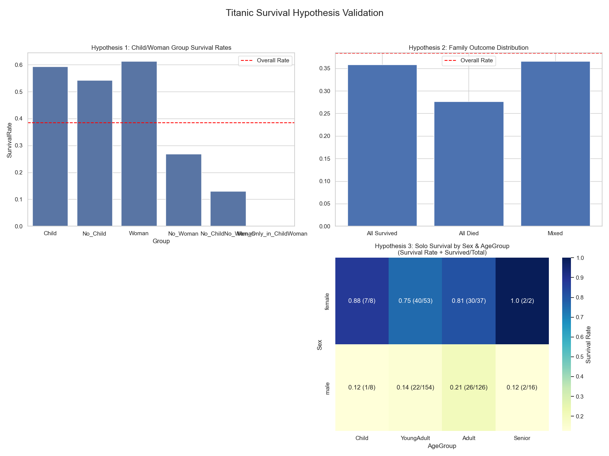
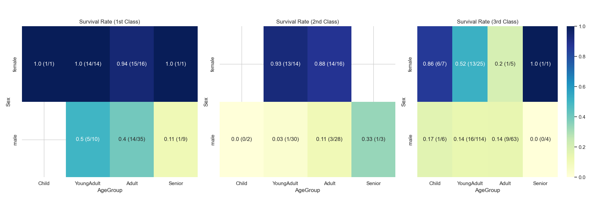

# 🛳 Titanic 생존자 분석

## ✨ 소개

Kaggle의 Titanic 데이터셋은 데이터 분석 입문자들이 가장 먼저 접하는 고전적인 자료입니다.  
보통은 상관계수(`corr()`)나 단일 변수(`Sex`, `Pclass` 등)별 생존률을 간단히 보는 것으로 분석을 마무리합니다.

하지만 이 프로젝트는 그보다 한 걸음 더 나아갑니다.  
단순한 변수 비교가 아닌, **탐구적 사고를 기반으로 가설을 세우고**,  
이를 데이터로 검증하는 과정을 통해 보다 깊은 인사이트를 도출합니다.

❓ **이런 질문을 가져볼 수 있습니다**
> - 타이타닉호에서 생존률이 **100%였던 성별+연령 조합**이 있다면 누구였을까요?
> - 가족 단위로 움직이는 배 안에서 **가족은 같은 운명**을 맞이했을까요?  
>   아니면 아이 또는 여성만 살렸을까요? 혹은 남성만 살아남은 경우도 있을까요?

--

## 1. 사용 데이터셋

- **출처**: https://www.kaggle.com/datasets/pranjalyadav92905/titanic-eda-data/data
- **주요 변수**: `Survived`, `Sex`, `Age`, `SibSp`, `Parch`, `Ticket`, `Fare`, `Pclass` 등
```python
import kagglehub

# Titanic EDA Dataset 다운로드
path = kagglehub.dataset_download("pranjalyadav92905/titanic-eda-data")

print("Path to dataset files:", path)
```
--

## 2. 분석 목적 및 가설

### 🎯 분석 목적  
- 생존 여부에 영향을 미치는 주요 변수 도출
- 가족 단위 탑승 그룹의 생존 패턴 탐색
- 혼자 탑승한 승객의 생존 확률 조건 분석

### 🧪 검증 가설

| 번호 | 가설 |
|------|------|
| 가설 1 | 가족 중 여성이나 아동이 포함된 그룹은 생존률이 높다 |
| 가설 2 | 가족 단위 탑승자의 경우 전원 생존 혹은 전원 사망 비율이 높다 |
| 가설 3 | 혼자 탑승한 승객의 생존률은 성별과 나이에 따라 다르다 |

---

## 3. 주요 분석 내용

- **파생 변수 생성**  
  - `IsChild`, `IsWoman`, `FamilySize`, `AgeGroup` 등
- **가족 그룹 추정**  
  - `Ticket` 기준 그룹핑, 2명 이상 탑승자 추출
  - `SibSp`, `Parch`를 활용한 가족 검증
- **가설별 생존률 계산**  
  - 생존률 비교, 조건부 필터링
- **시각화 결과**  
  - Bar Chart, Heatmap 등으로 그룹별 생존 패턴 시각화

---

## 4. 분석 결과 요약

| 가설 | 결론 |
|------|------|
| 가설 1 | 여성 또는 아동이 포함된 그룹은 평균보다 생존률이 높음 |
| 가설 2 | 가족 전체가 생존하거나, 전원 사망한 사례가 절반 이상 (All Survived + All Died = 약 60%) |
| 가설 3 | 혼자 탑승한 여성/아동은 생존률 높고, 남성은 낮음 |

#### 전체 가설 분석 결과 시각화 자료


#### 가설3 분석 결과 시각화 자료

